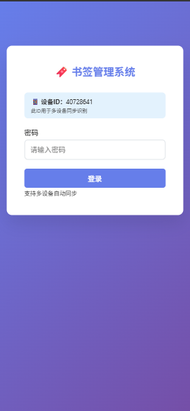

# 🔖 多设备同步书签管理系统

一个功能完整的个人书签管理系统，支持多设备实时同步，基于 Cloudflare 免费服务构建。

## ✨ 功能特色

- 🔐 **密码保护** - 安全的登录验证系统
- 🔄 **多设备同步** - 跨设备实时数据同步
- 📱 **响应式设计** - 完美适配手机、平板、桌面
- 🔍 **实时搜索** - 快速查找所需书签
- 🏷️ **标签管理** - 灵活的分类标签系统
- 📊 **数据统计** - 书签数量、标签统计等
- ⌨️ **快捷键** - 提升操作效率
- 🎨 **现代界面** - 美观的渐变设计和动效

## 🚀 在线演示

[点击这里查看演示](https://git-book.pages.dev) （默认密码：admin123）
你可以在里面添加你的书签，因为演示网站用的是浏览器本地存储的方式存储

## 📸 界面截图

### 桌面端


### 移动端


移动端的界面使用浏览器的开发者模式模拟的所以看起来可能会很小

## 🛠️ 部署方式

### 方案一：完整多设备同步（推荐）
支持真正的多设备数据同步，使用 Cloudflare 免费服务。

**所需服务**：
- Cloudflare Pages（静态托管）
- Cloudflare Workers（API 服务）
- Cloudflare KV（数据存储）

### 方案二：单设备版本
仅本地存储，部署简单，适合个人单设备使用。

**所需服务**：
- 任意静态文件托管服务

## 📋 快速部署

### 1. Cloudflare 完整部署

#### 步骤 1：创建 KV 命名空间
1. 登录 [Cloudflare Dashboard](https://dash.cloudflare.com/)
2. 进入 `Workers 和 Pages` → `KV`
3. 点击 `创建命名空间`，名称填写：`BOOKMARKS_KV`

#### 步骤 2：部署 Worker API
1. 进入 `Workers 和 Pages` → `创建应用程序` → `创建 Worker`
2. 将 `worker.js` 的内容复制到编辑器
3. 在 `设置` → `变量` 中绑定 KV：
   - 变量名称：`BOOKMARKS_KV`
   - KV 命名空间：选择刚创建的命名空间
4. 记录 Worker URL

#### 步骤 3：配置前端
修改 `index.html` 中的 API 端点：
```javascript
syncEndpoint: 'https://your-worker.your-subdomain.workers.dev/api/sync',
你也可以绑定你自己的域名，不过你要在你的域名后面添加/api/sync（例如xxxxxx.com//api/sync)
```

#### 步骤 4：部署网站
1. 进入 `Workers 和 Pages` → `创建应用程序` → `Pages`
2. 连接 GitHub 仓库或上传文件
3. 部署完成

## ⚙️ 配置选项

### 修改密码
在 `index.html` 中找到并修改：
```javascript
const CONFIG = {
    password: 'your-new-password', // 修改为您的密码
    // ...
};
```

### 自定义主题
修改 CSS 变量来更改界面颜色：
```css
:root {
    --primary-color: #667eea;
    --secondary-color: #764ba2;
    --success-color: #28a745;
    --danger-color: #dc3545;
}
```

### 调整同步间隔
修改自动同步频率（毫秒）：
```javascript
syncInterval = setInterval(() => {
    // 同步逻辑
}, 30000); // 30秒，可修改为其他值
```

## 🎯 使用说明

### 基本操作
1. **登录**：使用设置的密码登录系统
2. **添加书签**：点击 `➕ 添加书签` 按钮
3. **编辑书签**：点击书签卡片上的 `编辑` 按钮
4. **删除书签**：点击书签卡片上的 `删除` 按钮
5. **搜索书签**：在搜索框中输入关键词

### 快捷键
- `Ctrl/Cmd + K`：快速搜索
- `Ctrl/Cmd + N`：添加新书签
- `Ctrl/Cmd + S`：手动同步
- `Esc`：关闭模态框

### 标签使用
- 用逗号分隔多个标签：`工作,前端,React`
- 支持中文标签
- 点击标签可以快速筛选

### 多设备同步
- 自动后台同步（30秒间隔）
- 手动同步：点击 `🔄 同步` 按钮
- 冲突解决：以最新修改时间为准
- 离线支持：离线时数据保存本地，联网后自动同步

## 📁 项目结构

```
bookmark-manager/
├── index.html          # 主页面文件
├── worker.js           # Cloudflare Workers API 脚本
├── README.md           # 项目说明文档
├── LICENSE             # 开源协议
│   ├── image.png
└── └── image-1.png


## 🔧 开发说明

### 技术栈
- **前端**：原生 HTML/CSS/JavaScript
- **后端**：Cloudflare Workers
- **数据库**：Cloudflare KV
- **部署**：Cloudflare Pages

### 本地开发
```bash
# 启动本地服务器
npx serve .

# 或使用 Python
python -m http.server 8000
```

### API 接口

#### 健康检查
```
GET /api/health
```

#### 同步书签
```
POST /api/sync
Content-Type: application/json

{
  "deviceId": "device_xxx",
  "bookmarks": [...],
  "timestamp": "2024-01-01T00:00:00.000Z"
}
```

## 🐛 故障排除

### 常见问题

**Q: 同步状态显示"离线模式"**
A: 检查 `syncEndpoint` 配置是否正确，确认 Worker 服务正常运行

**Q: Worker 报错 "BOOKMARKS_KV is not defined"**
A: 确认在 Worker 设置中正确绑定了 KV 命名空间

**Q: 数据同步失败**
A: 查看浏览器控制台错误信息，检查网络连接和 API 状态


## 🤝 贡献指南

欢迎提交 Issue 和 Pull Request！

1. Fork 本项目
2. 创建特性分支：`git checkout -b feature/new-feature`
3. 提交更改：`git commit -am 'Add new feature'`
4. 推送分支：`git push origin feature/new-feature`
5. 提交 Pull Request

## 📄 开源协议

本项目基于 [MIT 协议](LICENSE) 开源。

如果这个项目对您有帮助，请给个 ⭐️ Star 支持一下！
