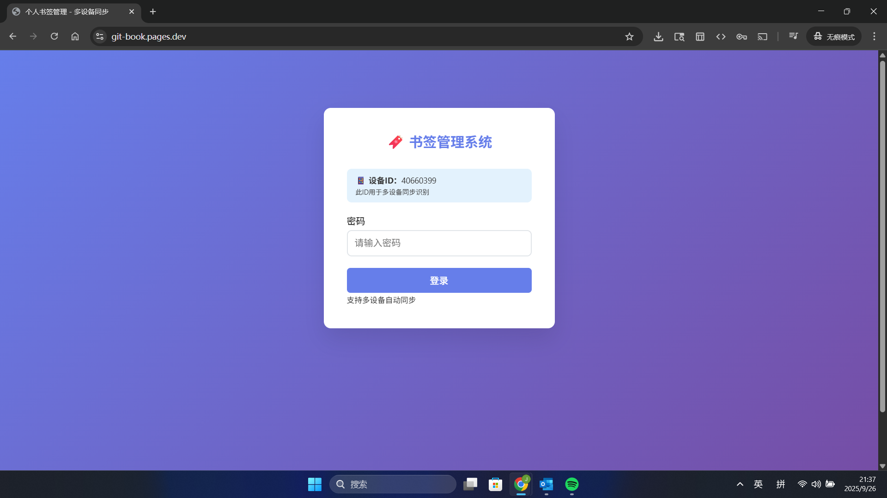

# 🔖 多设备同步书签管理系统

一个功能完整的个人书签管理系统，支持多设备实时同步，基于 Cloudflare 免费服务构建。

终于更新了，这版bug有点多测试了很久（托更就拖更没那么多理由）
## ✨ 功能特色

- 🔐 **密码保护** - 安全的登录验证系统
- 🔄 **多设备同步** - 跨设备实时数据同步
- 📱 **响应式设计** - 完美适配手机、平板、桌面
- 🔍 **实时搜索** - 快速查找所需书签
- 🏷️ **标签管理** - 灵活的分类标签系统
- 📊 **数据统计** - 书签数量、标签统计等
- ⌨️ **快捷键** - 提升操作效率
- 🎨 **现代界面** - 美观的渐变设计和动效
- 📁 **文件夹管理** - 创建、重命名、删除文件夹分类
- 🖱️ **拖拽操作** - 拖拽书签到文件夹或重新排序
- ⏰ **实时时钟** - 显示当前时间和日期
- 🔔 **更新提示** - 自动检测并提示新版本
- 👤 **多用户控制** - 多个用户使用同一个书签系统
## 🚀 在线演示

[点击这里查看演示](https://git-book.pages.dev) （默认密码：admin123）

你可以在里面添加你的书签，因为演示网站用的是浏览器本地存储的方式存储

## 📸 界面截图

### 桌面端


### 移动端


移动端的界面使用浏览器的开发者模式模拟的所以看起来可能会很小

## 🛠️ 部署方式

### 方案一：完整多设备同步（推荐）
支持真正的多设备数据同步，使用 Cloudflare 免费服务。

**所需服务**：
- Cloudflare Pages（静态托管）
- Cloudflare Workers（API 服务）
- Cloudflare KV（数据存储）

### 方案二：单设备版本
仅本地存储，部署简单，适合个人单设备使用。
只需要把index.html下载下来然后上传到cloudflare pages

**所需服务**：
- 任意静态文件托管服务

## 📋 快速部署（方案一）

### 1. Cloudflare 完整部署

#### 步骤 1：创建 KV 命名空间
1. 登录 [Cloudflare Dashboard](https://dash.cloudflare.com/)
2. 进入 `存储和数据库` → `KV`
3. 点击 `创建命名空间`，名称填写：`BOOKMARKS_KV`

#### 步骤 2：部署 Worker API
1. 进入 `Workers 和 Pages` → `创建应用程序` → `从Hello World开始`
2. 点击编辑代码
3. 将 `worker.js` 的内容复制到编辑器
4. 在 `设置` → `变量` 中绑定 KV：
   - 变量名称：`BOOKMARKS_KV`
   - KV 命名空间：选择刚创建的命名空间
5. 记录 Worker URL（你也可以绑定你自己的域名）

#### 步骤 3：部署网站
1. 进入 `Workers 和 Pages` → `创建应用程序` → `Pages`
2. 连接 GitHub 仓库或上传文件
3. 部署完成

## ⚙️ 配置选项

### 修改密码
去管理员界面改（最开始先用默认密码进去修改）

### 🎯 使用说明

### 基本操作
1. **登录**：使用设置的密码登录系统
2. **添加书签**：点击 `➕ 添加书签` 按钮，可选择文件夹分类
3. **编辑书签**：点击书签卡片上的 `编辑` 按钮
4. **删除书签**：点击书签卡片上的 `删除` 按钮
5. **搜索书签**：在搜索框中输入关键词

### 文件夹管理
1. **创建文件夹**：点击 `📁 文件夹` 按钮，输入文件夹名称
2. **重命名文件夹**：在文件夹管理界面点击 `重命名` 按钮
3. **删除文件夹**：点击文件夹标签上的 `×` 按钮或在管理界面删除
4. **切换文件夹**：点击文件夹标签查看不同分类的书签

### 拖拽操作
1. **重新排序**：拖拽书签卡片到其他位置重新排序
2. **移动到文件夹**：直接拖拽书签到文件夹标签上
3. **批量管理**：使用移动按钮批量移动书签

### 快捷键
- `Ctrl/Cmd + K`：快速搜索
- `Ctrl/Cmd + N`：添加新书签
- `Ctrl/Cmd + F`：文件夹管理
- `Ctrl/Cmd + S`：手动同步
- `Esc`：关闭模态框

### 标签使用
- 用逗号分隔多个标签：`工作,前端,React`
- 支持中文标签
- 点击标签可以快速筛选

### 多设备同步
- 自动后台同步（30秒间隔）
- 手动同步：点击 `🔄 同步` 按钮
- 冲突解决：以最新修改时间为准
- 离线支持：离线时数据保存本地，联网后自动同步

## 📁 项目结构

```
bookmark-manager/
├── index.html          # 主页面文件
├── worker.js           # Cloudflare Workers API 脚本
├── README.md           # 项目说明文档
├── LICENSE             # 开源协议
├── image.png           # 桌面端截图
└── image-1.png         # 移动端截图
```

## 🔧 开发说明

### 技术栈
- **前端**：原生 HTML/CSS/JavaScript
- **后端**：Cloudflare Workers
- **数据库**：Cloudflare KV
- **部署**：Cloudflare Pages


## 🆕 最新更新 v3.0.0

- ✅ **增强拖拽** - 支持拖拽书签到文件夹标签
- ✅ **文件夹重命名** - 可以重命名现有文件夹
- ✅ **快速删除** - 文件夹标签上的快速删除按钮
- ✅ **拖拽视觉反馈** - 更好的拖拽效果和提示
- ✅ **批量操作** - 改进的移动和管理功能
- ✅ **多用户管理** - 多个用户可以使用一个项目

## 🐛 故障排除

### 常见问题

**Q: 同步状态显示"离线模式"**
A: 检查 `syncEndpoint` 配置是否正确，确认 Worker 服务正常运行

**Q: Worker 报错 "BOOKMARKS_KV is not defined"**
A: 确认在 Worker 设置中正确绑定了 KV 命名空间

**Q: 数据同步失败**
A: 查看浏览器控制台错误信息，检查网络连接和 API 状态

**Q: 拖拽功能不工作**
A: 确保浏览器支持 HTML5 拖拽 API，检查是否有 JavaScript 错误

**Q: 文件夹删除后书签丢失**
A: 删除文件夹时，书签会自动移动到根目录（未分类），不会丢失

## 💰 成本说明

使用 Cloudflare 免费套餐：
- ✅ Workers：100,000 请求/天
- ✅ KV：100,000 读取/天，1,000 写入/天
- ✅ Pages：无限静态托管
- ✅ 全球 CDN 加速

个人使用完全免费！

## 🗺️ 开发路线图

### 计划中的功能
- [ ] **批量选择** - 多选书签进行批量操作
- [ ] **导入导出** - 支持浏览器书签导入导出
- [ ] **主题切换** - 深色/浅色主题
- [ ] **书签图标** - 自动获取网站图标
- [ ] **搜索优化** - 模糊搜索和搜索历史
- [ ] **PWA 支持** - 离线使用和桌面安装

### 技术改进
- [ ] **Service Worker** - 完整的离线缓存策略
- [ ] **虚拟滚动** - 大量书签的性能优化
- [ ] **API 优化** - 更高效的同步机制

## 📄 开源协议

本项目基于 [MIT 协议](LICENSE) 开源。

---

如果这个项目对您有帮助，请给个 ⭐️ Star 支持一下！

## 🔗 相关链接

- [在线演示](https://git-book.pages.dev)
- [GitHub 仓库](https://github.com/cloud-super111/Bookmark-Manager)
- [问题反馈](https://github.com/cloud-super111/Bookmark-Manager/issues)
- [Cloudflare Workers 文档](https://developers.cloudflare.com/workers/)
- [Cloudflare Pages 文档](https://developers.cloudflare.com/pages/)
